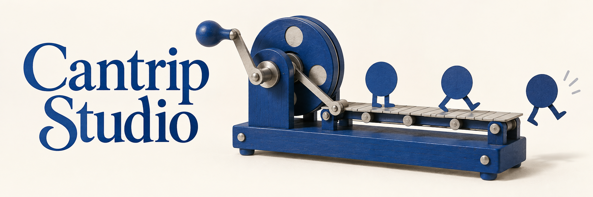

# Little Works

## Decision and reuse notes

Selected by Joshua as the replacement Cantrip homepage banner. Integrated and deployed on 2026-09-27. Cloudflare reported success and the public browser loaded the selected banner at its original dimensions.

Joshua’s verbatim selection feedback (shared across this collection):

> 100% the top one, but the other two will become something, also. The escher marble run WILL be used again, after some polish

## Brief and constraints

Replace the seasonal tableau with playful, whimsical artwork. Retain royal blue/navy/vellum cues from HoneyNEO DESIGN.md and compatibility with the existing typographic 10hi logo. Avoid Christmas imagery and the institutional castle/tower aesthetic. Homepage cues do not impose a shared visual style on the intentionally independent sub-pages.

Generated as a new alternative, not an edit of an uploaded image. The existing logo and banner were inspected as context, but no image reference was submitted to the generation tool. Original PNG preserved without editing. No polished derivative exists yet.

## Exact generation prompt

Create one polished final wide website hero banner, approximately 3:1 aspect ratio, for Cantrip Studio, a maker of small delightful websites and playful useful digital experiences people share with friends. This is a confident creative studio with wit, not a children's toy brand. Palette tightly limited to royal blue #0D3D8C, navy #001F4D, slate blue #3D5A8C, small silver/stone accents, warm vellum #FAF6EC background. Large exquisitely drawn readable serif lettering reading exactly "Cantrip Studio" on the left, graceful Caslon-like letterforms with personality, not gothic, integrated with the artwork; the right two-thirds carry a single strong illustrative idea. Nothing else written. Exceptional bespoke art direction and coherent composition, delightful and whimsical but restrained, generous breathing room, crisp craft. No Christmas or other holiday cues: no ribbons, ornaments, stars, glitter, gifts, houses, snow, baubles, greeting-card envelopes, no castles/towers/heraldry, no generic SaaS graphics, no browser dashboards, no gradient blobs. This should belong beside a refined blue typographic 10hi clock logo without imitating its institutional tone. CONCEPT A — LITTLE WORKS. A beautifully photographed handcrafted miniature kinetic workshop, on the same seamless vellum surface as the lettering. A compact royal-blue enamel contraption with a big friendly hand crank, silver axles, one eccentric wheel and a small tabletop track. Its wonderfully simple mechanical action turns a flat blue dot into a jaunty walking paper shape; show three successive little shapes along the track, one cheekily stepping off the end into open space. The contraption should be physically intelligible and elegant, a clever automaton rather than a tangle of gears. Real tactile painted wood, matte metal and thick paper. Warm daylight, precise soft contact shadows, eye-level three-quarter view, horizontal composition. The joke is small and legible. Typography is flat blue ink, not made of machine parts. Avoid toyshop clutter, conveyor factory realism, steampunk, brass, decorative confetti.
