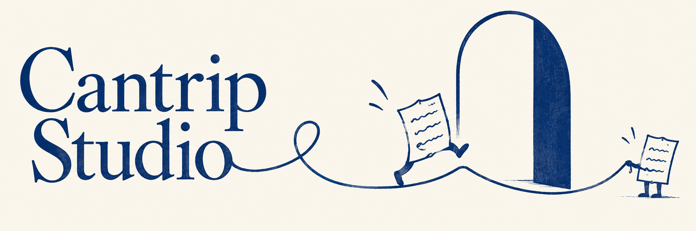

# An Inkling

## Decision and reuse notes

Not selected for this homepage. Retain as a useful future asset; specific use and polishing requirements have not been decided.

Joshua’s verbatim selection feedback (shared across this collection):

> 100% the top one, but the other two will become something, also. The escher marble run WILL be used again, after some polish

## Brief and constraints

Replace the seasonal tableau with playful, whimsical artwork. Retain royal blue/navy/vellum cues from HoneyNEO DESIGN.md and compatibility with the existing typographic 10hi logo. Avoid Christmas imagery and the institutional castle/tower aesthetic. Homepage cues do not impose a shared visual style on the intentionally independent sub-pages.

Generated as a new alternative, not an edit of an uploaded image. The existing logo and banner were inspected as context, but no image reference was submitted to the generation tool. Original PNG preserved without editing. No polished derivative exists yet.

## Exact generation prompt

Create one polished final wide website hero banner, approximately 3:1 aspect ratio, for Cantrip Studio, a maker of small delightful websites and playful useful digital experiences people share with friends. This is a confident creative studio with wit, not a children's toy brand. Palette tightly limited to royal blue #0D3D8C, navy #001F4D, slate blue #3D5A8C, small silver/stone accents, warm vellum #FAF6EC background. Large exquisitely drawn readable serif lettering reading exactly "Cantrip Studio" on the left, graceful Caslon-like letterforms with personality, not gothic, integrated with the artwork; the right two-thirds carry a single strong illustrative idea. Nothing else written. Exceptional bespoke art direction and coherent composition, delightful and whimsical but restrained, generous breathing room, crisp craft. No Christmas or other holiday cues: no ribbons, ornaments, stars, glitter, gifts, houses, snow, baubles, greeting-card envelopes, no castles/towers/heraldry, no generic SaaS graphics, no browser dashboards, no gradient blobs. This should belong beside a refined blue typographic 10hi clock logo without imitating its institutional tone. CONCEPT B — AN INKLING. Entirely two-dimensional commissioned illustration in royal-blue ink on warm vellum, lively economical hand-drawn line and expressive flat ink shapes with subtle printing grain. A continuous blue ink line escapes from the final letter of Studio, loops into a tiny skipping creature made of a folded note-sized rectangle with two simple legs, and ends as a bold open doorway-shaped loop that this cheeky little creature is stepping through. The drawn line is the storytelling device, not a ribbon; no shading or realistic paper cutouts. A second very small ink creature calmly holds the line like a jump rope at the far edge, creating a charming visual relationship. Witty adult literary illustration and independent print-shop sensibility; no imitation of any named artist. Very few elements; exuberance through gesture, proportion and space, not ornament. Typography has gorgeous quiet irregularity of hand-set letterpress and is the visual anchor. No eyes or smiley faces pasted onto objects, no corporate vector people.
