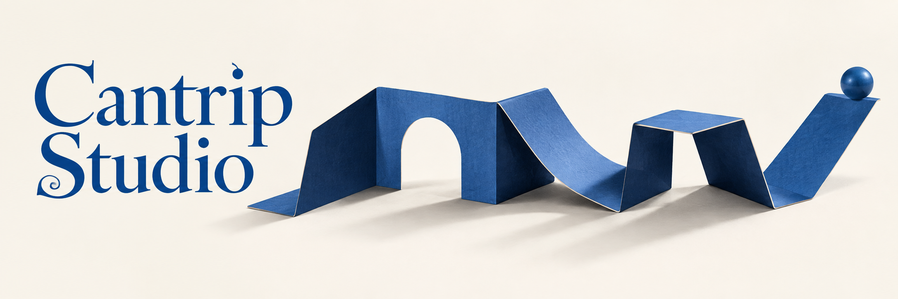

# A Small Surprise

## Decision and reuse notes

Joshua explicitly intends to reuse the Escher marble run after polishing. The future placement and exact polish brief remain undecided. Escher is Joshua’s descriptive alias, not a claim of authorship or a named-artist generation prompt.

Joshua’s verbatim selection feedback (shared across this collection):

> 100% the top one, but the other two will become something, also. The escher marble run WILL be used again, after some polish

## Brief and constraints

Replace the seasonal tableau with playful, whimsical artwork. Retain royal blue/navy/vellum cues from HoneyNEO DESIGN.md and compatibility with the existing typographic 10hi logo. Avoid Christmas imagery and the institutional castle/tower aesthetic. Homepage cues do not impose a shared visual style on the intentionally independent sub-pages.

Generated as a new alternative, not an edit of an uploaded image. The existing logo and banner were inspected as context, but no image reference was submitted to the generation tool. Original PNG preserved without editing. No polished derivative exists yet.

## Exact generation prompt

Create one polished final wide website hero banner, approximately 3:1 aspect ratio, for Cantrip Studio, a maker of small delightful websites and playful useful digital experiences people share with friends. This is a confident creative studio with wit, not a children's toy brand. Palette tightly limited to royal blue #0D3D8C, navy #001F4D, slate blue #3D5A8C, small silver/stone accents, warm vellum #FAF6EC background. Large exquisitely drawn readable serif lettering reading exactly "Cantrip Studio" on the left, graceful Caslon-like letterforms with personality, not gothic, integrated with the artwork; the right two-thirds carry a single strong illustrative idea. Nothing else written. Exceptional bespoke art direction and coherent composition, delightful and whimsical but restrained, generous breathing room, crisp craft. No Christmas or other holiday cues: no ribbons, ornaments, stars, glitter, gifts, houses, snow, baubles, greeting-card envelopes, no castles/towers/heraldry, no generic SaaS graphics, no browser dashboards, no gradient blobs. This should belong beside a refined blue typographic 10hi clock logo without imitating its institutional tone. CONCEPT C — A SMALL SURPRISE. Sophisticated tactile paper-engineering still life, shot in crisp sideways daylight on a seamless vellum background. A single long royal-blue accordion-fold sheet unfolds horizontally across the right two-thirds, and its folds become an ingenious small playground: one arch cut directly from the sheet, one curved slide, one cantilevered step. A solitary matte blue marble has just rolled through the arch and is balanced impossibly but convincingly on the final upward fold, a tiny delightful surprise. Only this paper construction and the one marble; everything grounded on the surface, not floating. Monochrome sculptural simplicity with deep navy undersides, subtle cream cut edges and beautiful long soft shadows. The paper engineering feels architectural in the sense of geometry, absolutely no buildings, no houses, no towers. Clever scale and rhythm. Caslon-like title on left printed directly on background in flat royal blue, large readable, balanced with folded structure. Not gift paper, not an envelope, no decorative stars.
